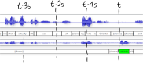
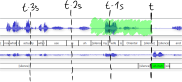
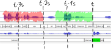
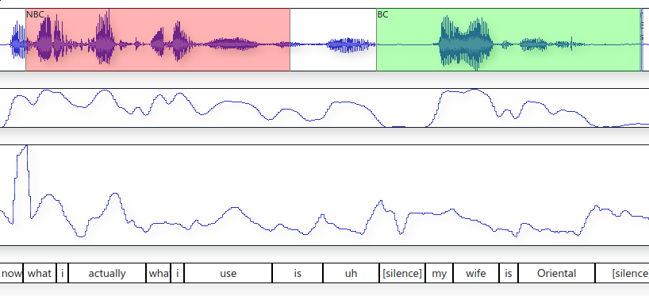
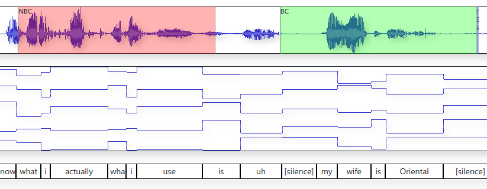
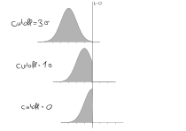

# Introduction

## What are backchannels (BCs)?

Feedback for the speaker from the listener

- Nodding / head movement
- Eye gaze shift
- Short phrases like "uh-huh", "yeah", "right"
- etc.

BCs help build _rapport_ (feeling of comfortableness between conversation partners)

- Vary from culture to culture (e.g. Japanese)

## Why backchannel prediction?

- Artificial assistants are becoming ubiquitous (Siri, Google Now, Alexa, Cortana, ...)
- Conversation with these is still distinctively unhuman
- BCs can help make conversations with an AI agent feel more natural

## Goal

- Simplify backchannels to only short phrases
- Predict when to emit backchannels
- Predict what kind of backchannel to emit

# Related Work

## Ward (2000)

Common approach: manually tuned rules.

> "[...] we formulate
> the following predictive rule for English:
> 
> Upon detection of
> 
> - a region of pitch less than the 26th-percentile pitch level and
> - continuing for at least 110 milliseconds,
> - coming after at least 700 milliseconds of speech,
> - providing you have not output back-channel feedback within the preceding 800 milliseconds,
> - after 700 ms wait,
>
> you should produce back-channel feedback."

--------

Common approach: manually tuned rules.

- error-prone
- a lot of manual work

semi-automatic approaches, e.g. [@morency_probabilistic_2010] extracted some hand-picked features such as binary pause regions and differend speech slopes. Then they tained  Hidden Markov Models to predict BCs from that.

# BC Prediction

## Dataset

Switchboard dataset:

- 2400 English telephone conversations 
- 260 hours total
- Randomly selected topics
- Transcriptions and word alignments that include BC utterances
 
## BC Utterance Selection (Theory)

- Get a list of backchannel phrases
- Separate those into categories
- 

## BC Utterance Selection (Practice)

Harder: Something like "uh" can be a disfluency or a BC.

-> only include phrases with silence or BC before them.

## Training Area Selection

## Training Area Selection

## Training Area Selection

Need area to predict non-BC.

→ Area of audio where no BC follows

. . .

Want balanced data set.

→ Choose area 0.5 seconds before BC area

## Training Area Selection

→ Balanced data

Context width?

## Feature Selection (Theory)

- Acoustic features like power, pitch

- Linguistic features (from the transcriptions)

## Feature Selection -- Acoustic

## Feature Selection -- Linguistic

"what i" has same encoding

# Neural network design

## Input layer

## Input layer

## Input layer

## Input layer

## Hidden layers (Feed forward)

## Hidden layers (Feed forward)

## Hidden layers (Feed forward)

## Hidden layers (Feed forward)

---

Feed forward net gets a fixed time context before the BC.

It can not take its previous state into account.

BCs are more probable after a longer period without BCs.

---

LSTM:

Image

LSTM is able to take into account it's own past internal state.

## Postprocessing

NN output is

- a value between 0 and 1
- noisy

## Postprocessing -- Low-pass filter

---

Gauss filter looks into future

-> Cut off gaussian filter and shift it

### Thresholding / Triggering

Use areas of output > t (0 < t < 1)

Image

Trigger 

(start, max, local max)

### Output audio trigger

place uh-huh sample beginning at trigger time.

## Lots of parameters to tune

- Context width
- Context stride
- Which features
- NN depth
- NN layer sizes
- LSTM vs Feed forward
- Gaussian filter sigma
- Gaussian filter cutoff
- Prediction delay

# Evaluation

Use only monologuing segments from dataset

## Survey

Randomly show participants 6 samples of the following categories

1. Random predictor
2. NN predictor
3. Ground truth

## Objective Evaluation

- Precision (portion of predictions that were correct)
- Recall (portion of correct BCs that were predicted)
- F1-Score (harmonic mean of Precision and Recall)

{#fig:varythreshold}

# Results

## Context width

## Context stride

## Features

## LSTM vs FF

## Layer sizes

## Final results / Comparison

## Multicat output

# Implementation

# Conclusion and Future Work