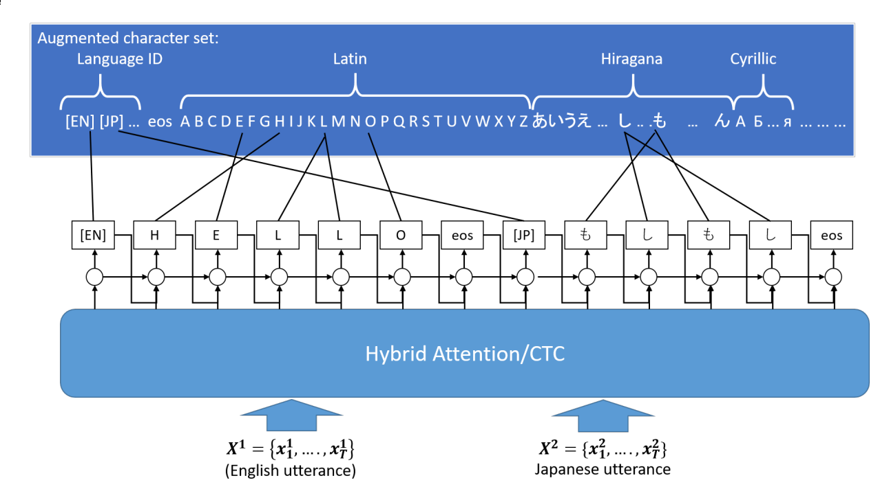
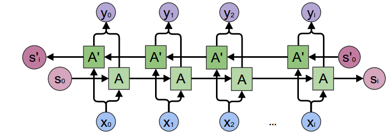
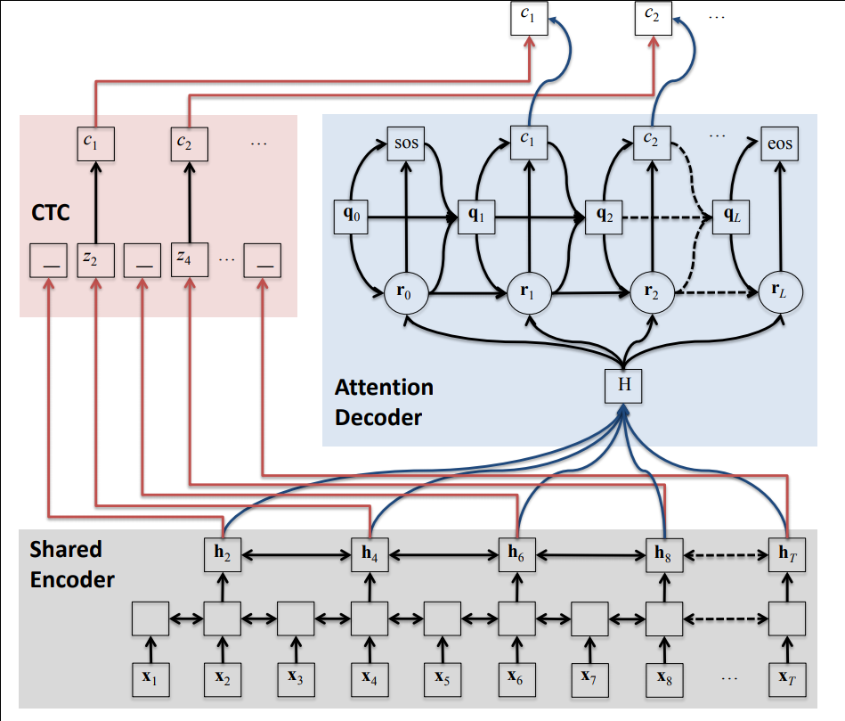
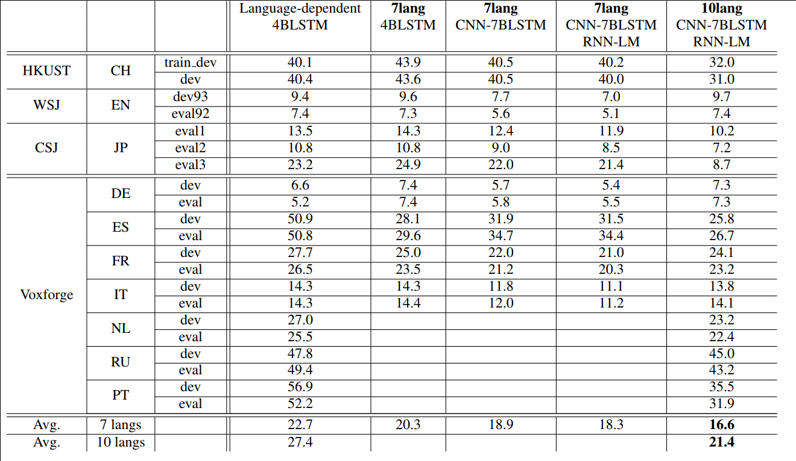
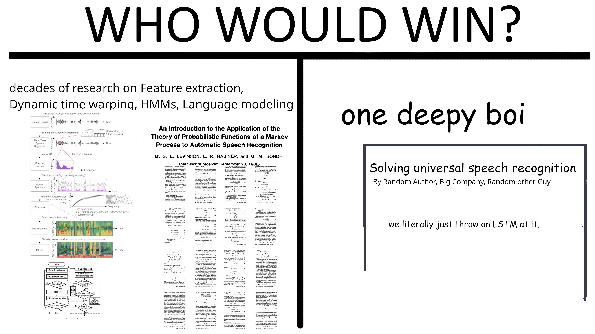

## Motivation / Goal

Recognize multiple languages at the same time

- Use a single model for 10 languages (EN, JP, CH, DE, ES, FR, IT, NL, PT, RU)
- Check if transfer learning between languages work
- Two tasks: identify language AND recognize speech (simultaneously)

- End to end: Directly train sequence to sequence, no lexicon, phoneme pronounciation maps, or manual alignment

## Problems

- How to input audio?

    → Spectral features of audio frames (e.g. in 10ms segments)

. . .

- How to output text?
    (a) word embeddings (word2vec) (would need fixed dictionary)
    (b) characters (one-hot)
        - Different char sets for languages (abc, äàąå, 漢字, ҐДЂ, ひらがな)
        - Just unify all character sets (5500 total)

. . .

- How to output language id?
    (a) separate one-hot output
    (b) as a special character: `[EN]Hello [CH]你好`

# Related Work

## Related Work

<!-- (e.g. only attention) -->

- _Multilingual Speech Recognition With A Single End-To-End Model_ (Shubham Toshniwal)
    - separate output for language id
    - only on 9 indian languages, hard to compare

- _Hybrid CTC/Attention Architecture for End-to-End Speech Recognition_ (Watanabe et al. 2017).”
    - Same as this paper except only one language and more detailed

# Model overview

## Model overview

## Simple Model overview

1. Input: for each audio frame one 2d input image, 3 channels (like RGB image processing)
2. Encoder
    #. VGGNet Convolutional NN (first 6 layers)
    #. One bidirectional LSTM layer
3. Decoder (Attention + one directional LSTM)
    #. Soft Attention for each input frame to each output character
    #. LSTM Layer
    #. Fully connected layer (per time step)
4. Output
    - N characters from union of all languages (one-hot / softmax)

## Input

(Ab)use of image processing pipeline - input formatted like a RGB image

* first channel: spectral features
* second channel: delta spectral features
* third channel: deltadelta spectral features

"To use the same dimensional input features, we used 40-dimensional filterbank features with 3-dimensional pitch features implemented in Kaldi [33]"

either just one feature map or they have some convolution issues

## Encoder - VGG Net Architecture

## Encoder - VGG Net Architecture - First six layers

(actual input dimensions are not mentioned)

## Encoder - Bidirectional LSTM layer

320 cells for each direction → 640 outputs per time step ($\vec{h}_t$)

http://colah.github.io/posts/2015-09-NN-Types-FP/

## Decoder (Attention-based)

Input: $\vec{x}_1,\dots,\vec{x}_t$

Output: $c_1,\dots,c_l$

1. Encode whole sequence to $\vec{h}_1,\dots,\vec{h}_t$
2. Calculate soft attention weights $a_{lt}$, based on
    (a) $a_{(l-1)t}$ (attention on same input for previous output)
    (b) current encoded state $\vec{h}_t$
    (c) previous hidden state $\vec{q}_{l-1}$

. . .

3. Sum encoded state with soft alignment: $\vec{r}_l = \sum_t{a_{lt}\vec{h}_t}$
4. Decoder = $\text{Softmax}(\text{FC}(\text{LSTM}(\vec{r}_l, \vec{q}_{l-1}, c_{l-1})))$

## Problems with this simple model

- Pure temporal attention too flexible, allows nonsensical alignments
    - Intuition: In MT word order can change, in ASR not
- Languages must be implicitly modeled

# Additions to the simple model

## Problem 1: "Pure temporal attention too flexible"

Add a second, Parallel Decoder with CTC

1. Input (same as before)
1. Encoder (same as before)
2. Decoder

    fully connected softmax layer per time stemp (converts 640 outputs from BLSTM → N characters)
3. → One output character per input frame, using CTC Loss

## CTC Crash Course

Problem: output sequence shorter than input sequence

* First, add blank character `"-"` to set. e.g. HELLO → $\{H, E, L, O, -\}$

. . .

* Inference: Remove duplicates: HHHH-EEEEEEEE-LL-LLL-\-\-\-OOOOOO → H-E-L-L-O → HELLO

. . .

* Training: HELLO → H-E-L-L-O → all combinations of char duplications are ok

. . .

→ Enforces monotonic alignment

* Efficient computation using Viterbi / forward-backward algorithm
* Loss = negative log of GT probability

<https://towardsdatascience.com/intuitively-understanding-connectionist-temporal-classification-3797e43a86c>

## Problem 2: "Languages must be implicitly modeled"

Add a RNN-LM

- Model distribution of character sequences in languages (ignores input speech)
- Trained seperately 

## Combine both decoders + RNN-LM

{width=50%}

## Final loss function

$$\mathcal{L}_{\text{MTL}} = \lambda \log p_{\text{ctc}} (C|X) + (1 - \lambda) \log p_{\text{att}}(C|X) + \gamma \log p_{\text{rnnlm}}(C) $$

$\lambda = 0.5$, $\gamma = 0.1$

## Training

- Inference via beam search on attention output weighted by loss function

- AdaDelta optimization, 15 epochs

## Conclusions

- adding a pure language model (RNN-LM) improves performance a bit

- [On single language ASR] "Surprisingly, the method achieved performance comparable to, and in some cases superior to, several state-ofthe-art HMM/DNN ASR systems [...] when both multiobjective learning and joint decoding are used."

## Result Table

{height=60%}

## Language Confusion Matrix

## Potential problems / future work?

- Nothing ensures language does not switch mid sentence → Apparently not an issue
    - but maybe we want to allow this? (append utterances from different languages)

. . .

- Uniform random parameter initialization with [-0.1, 0.1] sounds bad

. . .

- Does not work in realtime (without complete input utterance)
    - Bidirectional LSTM in encoder
        - Could try one directional, but Language ID would completely break
        - aggregate limited number of future frames (e.g. add 500ms latency between input and output)
    - Does CTC work in real time?
    - Attention does not work in realtime

. . .

- Unbalanced language sets (500h CH, 2.9h PR)
- Same latin characters are used for multiple languages, while others (RU, CH, JP) get their own character set
    - Try transliterating them to Latin?

# Thank you for your attention

## ...

