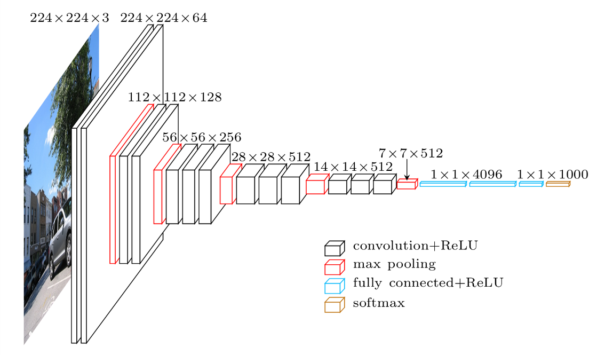
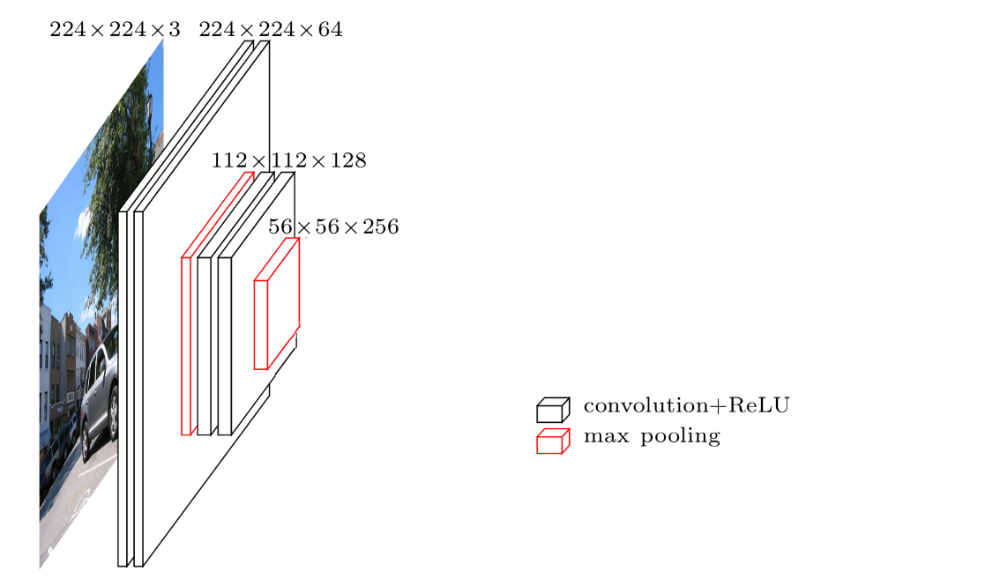

## Motivation / Goal

Recognize multiple languages at the same time

- Use a single model for 10 languages (EN, JP, CH, DE, ES, FR, IT, NL, PT, RU)
- Check if transfer learning between languages work
- two tasks: identify language AND recognize speech (simultaneously)

# Related Work

## Related Work

(e.g. only attention)

- Multilingual Speech Recognition With A Single End-To-End Model (Shubham Toshniwal)
    - separate output for language id
    - only on 9 indian languages

# Model overview

## Model overview

## Model overview

1. Input: for each audio frame one 2d input image, 3 channels (like RGB image processing)
    - spectral features
2. Encoder
    #. VGGNet Convolutional NN (first 6 layers)
    #. One bidirectional LSTM layer (320 cells x2)
3. Decoder (Attention + one directional LSTM)
    - Soft Attention for each input frame to each output character
    - LSTM (300 cells), input: previous hidden state and output, attention-weighted input features
    - fully connected layer (converts 300 outputs from LSTM -> N characters softmax)
4. Output
    - N characters from union of all languages (softmax)

## Input

(Ab)use of image processing pipeline - input formatted like a RGB image

first channel: spectral features
second channel: delta spectral features
third channel: deltadelta spectral features

probably cepstral? fourier, fundamental frequency variation? etc

either just one feature map or they have some convolution issues

## Encoder - VGG Net Architecture

## Encoder - VGG Net Architecture - First six layers

(actual input dimensions are not mentioned)

## Encoder - Bidirectional LSTM layer

320 cells *2 = 640 outputs per time step

http://colah.github.io/posts/2015-09-NN-Types-FP/

## Decoder (Attention-based)

## 2. Decoder (CTC)

1. Input (same as before)
1. Encoder (same as before)
2. Decoder (CTC)
    fully connected layer per time stemp (converts 640 outputs from BLSTM -> N characters, softmax)
3. One output character per input frame, normalized using CTC Loss

* First, add blank character to set. e.g. Hello -> {H, E, L, O, -}
* Inference: Remove duplicates: HHHH-EEEEEEEE-LL-LLL----OOOOOO → H-E-L-L-O → HELLO
* Training: HELLO → H-E-L-L-O → all combinations of char duplications are ok

https://towardsdatascience.com/intuitively-understanding-connectionist-temporal-classification-3797e43a86c

## RNN-LM

- Model distribution of characters in languages (ignores input speech)

## Combine both decoders + RNN-LM

- AdaDelta optimization

- Training objective function: 0.5 * CTC loss + 0.5 * Attention loss + 0.1 RNN-LM loss

- Inference via beam search on attention output weighted by objective function

## Conclusions

- adding a pure language model (RNN-LM) improves performance a bit

## Potential problems / future work?

- uniform random parameter initialization with [-0.1, 0.1] sounds bad
- does not work in realtime (without complete input utterance)
    - Bidirectional LSTM in encoder
        - Could try one directional, but Language ID would completely break
    - CTC in realtime?
    - Attention does not work in realtime
- same latin characters are used for multiple languages, while others (RU, CN, JP) get their own character set

 
## BC Utterance Selection

- Get a list of all backchannel phrases
<!--- Separate those into categories-->
- BC phrase list from the _Switchboard Dialog Act Corpus_ (SwDA)

. . .

SwDA incomplete

→ Identify utterances only from their text

Something like "uh" can be a disfluency or a BC.

→ only include phrases with silence or BC before them.

<!--
## Training Area Selection

Need area to predict non-BC.

→ Area of audio where no BC follows

Want balanced data set.

→ Choose area 0.5 seconds before BC area
-->

→ Balanced data

## Feature Selection

- Acoustic features like power, pitch

- Linguistic features (from the transcriptions)

<!-- "what i" has same encoding -->

# Neural network design

## Recurrent NNs

BCs are more probable after a longer period without BCs.

→ Use RNN / LSTM

. . .

## Postprocessing

NN output is

- a value between 0 and 1
- quickly changing
- noisy

## Postprocessing -- Low-pass filter

Gauss filter looks into future

→ Cut off filter and shift it

## Thresholding / Triggering

- Use areas of output > threshold t (0 < t < 1)
- Trigger at local maximum

# Evaluation

## Objective Evaluation

- Precision (portion of predictions that were correct)
- Recall (portion of correct BCs that were predicted)
- F1-Score (harmonic mean of Precision and Recall)

## Lots of parameters to tune

- Context width
- Context stride
- Which features
- NN depth
- NN layer sizes
- LSTM vs Feed forward
- Trigger threshold
- Gaussian filter sigma
- Gaussian filter cutoff
- Prediction delay

## Lots of parameters to tune

manually through trial and error:

- Context width
- Context stride
- Which features
- NN depth
- NN layer sizes
- LSTM vs Feed forward

automatically with Bayesian optimization:

- Trigger threshold
- Gaussian filter sigma
- Gaussian filter cutoff
- Prediction delay

# Results

## Context width

\begin{table}
    \centering
    \begin{tabular}{cccc}
    \hline\noalign{\smallskip}
    Context & Precision & Recall & F1-Score \\
    \noalign{\smallskip}\svhline\noalign{\smallskip}
    500\,ms & 0.219 & 0.466 & 0.298 \\
    1000\,ms & 0.280 & 0.497 & 0.358 \\
    1500\,ms & 0.305 & 0.488 & \bf{0.375} \\
    2000\,ms & 0.275 & 0.577 & 0.373 \\
    \noalign{\smallskip}\hline\noalign{\smallskip}
    \end{tabular}
    \caption{Results with various context lengths. Performance peaks at 1500\,ms.}\label{tbl:varycontext}
\end{table}

## LSTM vs FF

\begin{table}
    \centering
    \begin{tabular}{ccccc}
    \hline\noalign{\smallskip}
    Layers & Parameter count & Precision & Recall & F1-Score \\
    \noalign{\smallskip}\svhline\noalign{\smallskip}
    FF ($56 : 28$) & 40k & 0.230 & 0.549 & 0.325 \\
    FF ($70 : 35$) & 50k & 0.251 & 0.468 & 0.327 \\
    FF ($100 : 50$) & 72k & 0.242 & 0.490 & 0.324 \\
    LSTM ($70 : 35$) & 38k & 0.305 & 0.488 & \bf{0.375} \\
    \noalign{\smallskip}\hline\noalign{\smallskip}
    \end{tabular}
    \caption{LSTM outperforms feed forward architectures.}\label{tbl:varylstm}
\end{table}

## Layer sizes

\begin{table}
    \centering
    \begin{tabular}{cccc}
    \hline\noalign{\smallskip}
    Layer sizes & Precision & Recall & F1-Score \\
    \noalign{\smallskip}\svhline\noalign{\smallskip}
    $100$ & 0.280 & 0.542 & 0.369 \\
    $50 : 20$ & 0.291 & 0.506 & 0.370 \\
    $70 : 35$ & 0.305 & 0.488 & \bf{0.375} \\
    $100 : 50$ & 0.303 & 0.473 & 0.369 \\
    $70 : 50 : 35$ & 0.278 & 0.541 & 0.367 \\
    \noalign{\smallskip}\hline\noalign{\smallskip}
    \end{tabular}
    \caption{Comparison of different network configurations. Two LSTM layers give the best results.}\label{tbl:varylayers}
\end{table}

## Features

\begin{table}
    \centering
    \begin{tabular}{lccc}
    \hline\noalign{\smallskip}
    Features & Precision & Recall & F1-Score \\
    \noalign{\smallskip}\svhline\noalign{\smallskip}
    power & 0.244 & 0.516 & 0.331 \\
    power, pitch & 0.307 & 0.435 & 0.360 \\
    power, pitch, mfcc & 0.278 & 0.514 & 0.360 \\
    power, ffv & 0.259 & 0.513 & 0.344 \\
    power, ffv, mfcc & 0.279 & 0.515 & 0.362 \\
    power, pitch, ffv & 0.305 & 0.488 & \bf{0.375} \\
    \noalign{\smallskip}\hline\noalign{\smallskip}
    word2vec$_{dim=30}$ & 0.244 & 0.478 & 0.323 \\
    power, pitch, word2vec$_{dim=30}$ & 0.318 & 0.486 & 0.385 \\
    power, pitch, ffv, word2vec$_{dim=15}$ & 0.321 & 0.475 & 0.383 \\
    power, pitch, ffv, word2vec$_{dim=30}$ & 0.322 & 0.497 & \bf{0.390} \\
    power, pitch, ffv, word2vec$_{dim=50}$ & 0.304 & 0.527 & 0.385 \\
    \noalign{\smallskip}\hline\noalign{\smallskip}
    \end{tabular}
    \caption{Results with various input features, separated into only acoustic features and acoustic plus linguistic features.}\label{tbl:varyfeatures}
\end{table}

## Other research

\begin{table}
    \small
    \centering
    %\caption{Final best results on the evaluation set (chosen by validation set)}\label{tbl:final}
    \begin{tabular}{p{6cm}ccc}
    \hline\noalign{\smallskip}
        Predictor & Precision & Recall & F1-Score \\
        \noalign{\smallskip}\svhline\noalign{\smallskip}
        Baseline (random) & 0.042 & 0.042 & 0.042 \\
        Müller et al. (offline) & -- & -- & 0.109 \\
        Our results (offline, context of \SIrange{-750}{750}{ms}) & 0.114 & 0.300 & \bf{0.165} \\
        Our results (online, context of \SIrange{-1500}{0}{ms}) & 0.100 & 0.318 & 0.153 \\
    \noalign{\smallskip}\hline\noalign{\smallskip}
    \end{tabular}
    \caption{Comparison with previous research.\label{tbl:mueller}}
\end{table}

---

## Varying margin of error

\begin{table}
    \scriptsize
    \centering
    \begin{tabular}{p{2.4cm}p{3.7cm}ccc}
    \hline\noalign{\smallskip}
        Margin of Error & Constraint & Precision & Recall & F1-Score \\
        \noalign{\smallskip}\svhline\noalign{\smallskip}
        \SIrange{-200}{200}{ms} && 0.172 & 0.377 & 0.237 \\
        \SIrange{-100}{500}{ms} &&	0.239 & 0.406 & 0.301 \\
        \SIrange{-500}{500}{ms} && 0.247 & 0.536 & 0.339 \\
    \hline\noalign{\smallskip}
        \SIrange{0}{1000}{ms} %& Baseline (random, correct BC count) & 0.111 & 0.052 & 0.071 \\
         & Baseline (random) & 0.079 & 0.323 & 0.127 \\
         %& Balanced Precision and Recall & 0.342 & 0.339 & 0.341 \\
         & Only acoustic features & 0.294 & 0.488 & 0.367 \\
         & Acoustic and linguistic features & 0.312 & 0.511 & 0.388 \\
    \noalign{\smallskip}\hline\noalign{\smallskip}
    \end{tabular}
    \caption{Results with various margins of error used in other research. Performance improves with a wider margin width and a later margin center.\label{tbl:ourbest}}
\end{table}

## Survey

Randomly show participants 6 samples of the following categories

1. Random predictor
2. NN predictor
3. Ground truth

## Survey

{#fig:bcsurvey width=60%}

## Survey Results

\begin{table}
\begin{tabular}{ccccc}
\hline\noalign{\smallskip}
Predictor & Sample & Timing & Naturalness & Sample Size \\
\noalign{\smallskip}\svhline\noalign{\smallskip}
random & average & 2.33 points & 2.63 points & 40 \\
\noalign{\smallskip}\hline\noalign{\smallskip}
nn & average & 3.48 points & 3.08 points & 40 \\
\noalign{\smallskip}\hline\noalign{\smallskip}
truth & average & 4.20 points & 4.08 points & 40 \\
\noalign{\smallskip}\hline\noalign{\smallskip}
\end{tabular}
    \caption{Average user ratings of different BC predictors}
\end{table}

<!--# Implementation

# Conclusion and Future Work-->

# Thank you for your attention

# Addendum

## Demo

<http://localhost:3000/#N4IgDgNghgngRlAxgawAoHsDOBLALt9AOxAC5CBXCCAGhADN0r0B3VaeJZUuqCTAU1qIiAN34AnTFHxFSITMwAsAJgAMykLXLZMpANqg6-aeXH9dJA-WO5T-OQHoAgg-4APXOKS5+AEwdQvoiaICI65LzYAF4ScgDqUGIM4gC2IcKEdNgA5nKE6KmRMQAy6Ii86aZmhLgASlCE2fYkoCnYxCQAtKoAdACMAOx9AGwAnH0AHKOKAKwAzH3KM7QpUG6kvX2KqjPDc6PDihOKcwMzAL5a2r6kW+cAurQAFvw5T7hyUOS46CHk17c5pdDDY7BYrEYTGZHC5PA1MIhxNgwLgHD4PCEwpgIhBorESCAACruD5CIhZXIE-KFXElMoVIRVfg1eqNZoUKhXbA3EgjB7PV7Zd6fb6-Lk8voXaigf7c24DWiQ2xmcEgqHNEDONFeQgIpEohzMAq+XTi24TWhYnF48RyYkYsmZHJ5AqrWn8UrlCCVcTVOoNJqkDkQfkgF5vD4Er4-EDA6zq1Xx5UarUAOVTAAJ0N8wN9MA4RDtVJ0shRCNgsn5OiNOtk+nB+ItFHBOr5sOJcDASHxcClOg3MLgS6CVZ0wCwJNQwHhEE9qHQ6CJqEbxL5lGJEAB9NspObFzAQFgIXCzhwD0mhcJFfEgBJJV3pcnOqmu6+ehkgRBMlkB5qtdobD06iHMoiiKMMZx7MMyjjMsICrOsJC9KMMyjBMfSjKchzDBMwwzMclwgLKPJqKG4ZCpGMzKGavKjHGSpgvoarJjCDjplmOZ5gWRYlu05DlpWvjVsMtb1o2oEtm2HZdj2fbnsOCZjhO4hTjOc4LkuK5rhu27YLu+6Hswx6nuePSYCk6DoLgTyYle7q2gSd78MkaSOhSLo0ni77eoyvrMv6bKkP+HS9KoJx9Kocx7PMfSxcoEF9CsayAVMGHjAM0wRZhYFSkRAIkMoyj0SOKYuOx2a4LmuD5oWMzFqW-EVtgVY1nWDZNpJ7adt2g5yeYQ4MaO47MJO04nupi7Lsa678FuO57p0B5HtIJn9WZFlWU8PTWSqfz5cocyWnZNpyAAEm8uIUaan5PpSIDUm6Xn0j5n7fgFgZkJQIaPGGgrCiQExwcRpDKH0xUJkxSZ2Kx5WcdV3F1bxZZNS1IlteJzatl1Mm9f2-UKcmmBKSNKljbO86TVpM1zXpC1LUZK1PGea3mZZ1k9HAwRHdi14ObeiTOQ+bnPvdr7ut5Pp+qyH3BaQ3Q9DMsWKH0cwzAMKiTGcSWIb0UEDBlAyA5K0G5cDBUXD95H-RM1F5XKBWKKGUSWWkLQgBAzmRr0itqDbMGRWrhUjLQSIUYBww7DM4EjNlYGqJMhE-LgvCEnp-AAMqzUQJog6MowK4V5xAA>

## SwDA categories

\begin{figure}
\centering
\scriptsize
\begin{tabular}{cp{3cm}cp{4cm}r}
    \hline\noalign{\smallskip}

    ~ & name & act\_tag & example & full\_count \\

    \noalign{\smallskip}\svhline\noalign{\smallskip}

    1 & Statement-non-opinion & sd & Me, I'm in the legal department. &  75145\tabularnewline
    2 & \bf{Acknowledge (Backchannel)} & b & Uh-huh. &  38298\tabularnewline
    3 & Statement-opinion & sv & I think it's great &  26428\tabularnewline
    4 & Agree/Accept & aa & That's exactly it. &  11133\tabularnewline
    5 & Abandoned or Turn-Exit & \% & So, - &  15550\tabularnewline
    6 & Appreciation & ba & I can imagine. &  4765\tabularnewline
    7 & Yes-No-Question & qy & Do you have to have any special training? &  4727\tabularnewline

    \noalign{\smallskip}\hline\noalign{\smallskip}
\end{tabular}
\caption{SwDA categories}
\label{tbl:swda}
\end{figure}

## Context stride

\begin{table}
    \centering
    \begin{tabular}{cccc}
    \hline\noalign{\smallskip}
    Stride & Precision & Recall & F1-Score \\
    \noalign{\smallskip}\svhline\noalign{\smallskip}
    10ms & 0.290 & 0.490 & 0.364 \\
    20ms & 0.305 & 0.488 & \bf{0.375} \\
    40ms & 0.285 & 0.498 & 0.363 \\
    \noalign{\smallskip}\hline\noalign{\smallskip}
    \end{tabular}
    \caption{Results with various context frame strides.}\label{tbl:varystrides}
\end{table}